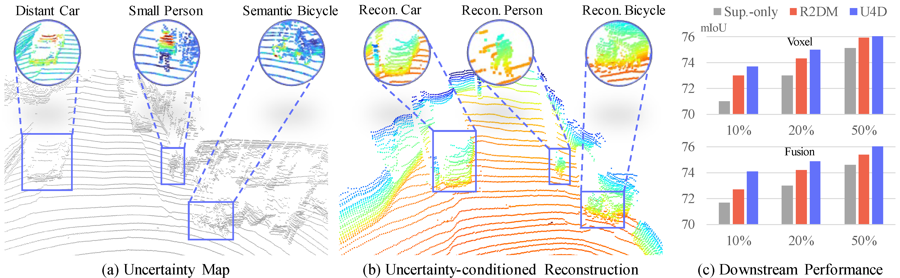

<p align="right">English | <a href="./README_CN.md">简体中文</a></p>

<p align="center">
    <h1 align="center">
        <strong>U4D: Uncertainty-Aware 4D World Modeling from LiDAR Sequences</strong>
    </h1>
    <p align="center">
        <a href="https://xiangxu-0103.github.io/" target="_blank">Xiang Xu</a>&nbsp;&nbsp;&nbsp;&nbsp;
        <a href="https://alanliang.vercel.app/" target="_blank">Ao Liang</a>&nbsp;&nbsp;&nbsp;&nbsp;
        <a href="" target="_blank">Youquan Liu</a>&nbsp;&nbsp;&nbsp;&nbsp;
        <a href="" target="_blank">Linfeng Li</a>&nbsp;&nbsp;&nbsp;&nbsp;
        <a href="https://ldkong.com/" target="_blank">Lingdong Kong</a>&nbsp;&nbsp;&nbsp;&nbsp;
        <a href="https://liuziwei7.github.io/" target="_blank">Ziwei Liu</a>&nbsp;&nbsp;&nbsp;&nbsp;
        <a href="" target="_blank">Qingshan Liu</a>&nbsp;&nbsp;&nbsp;&nbsp;
    </p>
    <p align="center">
      <a href="https://arxiv.org/abs/2512.02982" target="_blank"></a>&nbsp;
      <a href="" target="_blank"></a>&nbsp;
      <a href="" target="_blank"></a>&nbsp;
      <a href="" target="_blank"></a>
    </p>
</p>



In this work, we introduce **U4D**, an uncertainty-aware framework for 4D LiDAR world modeling. The main contributions are:

- We introduce the **first** uncertainty-aware LiDAR generation framework that explicitly models spatial difficulty to enhance reliability in 4D world modeling.
- We design a **two-stage hard-to-easy** generation paradigm that reconstructs uncertain regions first and then completes the full scene under these priors.
- We develop a **Mixture of Spatio-Temporal (MoST)** block that ensures temporal consistency across frames by adaptively balancing spatial geometry and temporal dynamics.

### :books: Citation

If you find this work helpful for your research, please kindly consider citing our paper:

```bibtex
@article{xu2025U4D,
    title   = {{U4D}: Uncertainty-Aware {4D} World Modeling from {LiDAR} Sequences},
    author  = {Xu, Xiang and Liang, Ao and Liu, Youquan and Li, Linfeng and Kong, Lingdong and Liu, Ziwei and Liu, Qingshan},
    journal = {arXiv preprint arXiv: 2512.02982},
    year    = {2025}
}
```

## Updates

- **\[12.2025\]** - The [technical report](https://arxiv.org/abs/2512.02982) of **U4D** is available on arXiv.

## License

This work is under the <a rel="license" href="https://www.apache.org/licenses/LICENSE-2.0">Apache License Version 2.0</a>, while some specific implementations in this codebase might be with other licenses. Kindly refer to [LICENSE.md](docs/LICENSE.md) for a more careful check, if you are using our code for commercial matters.

## Acknowledgements

This work is developed based on the [R2DM](https://github.com/kazuto1011/r2dm) codebase.
